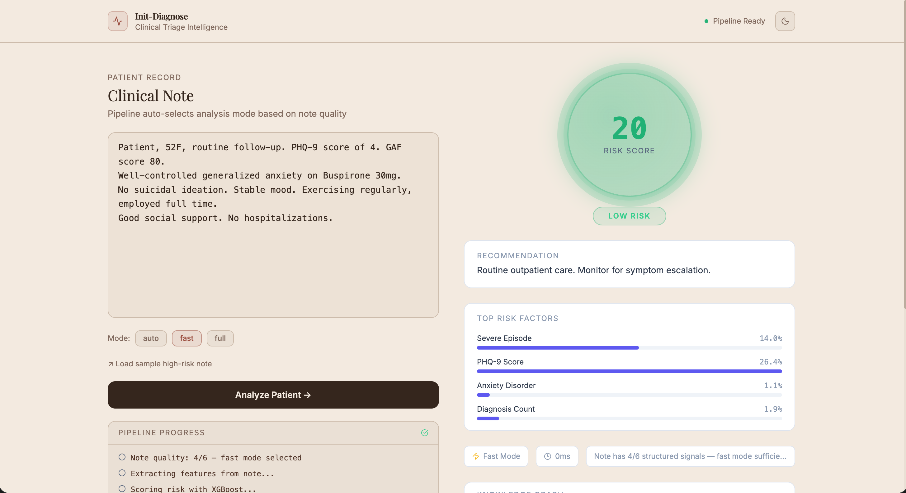
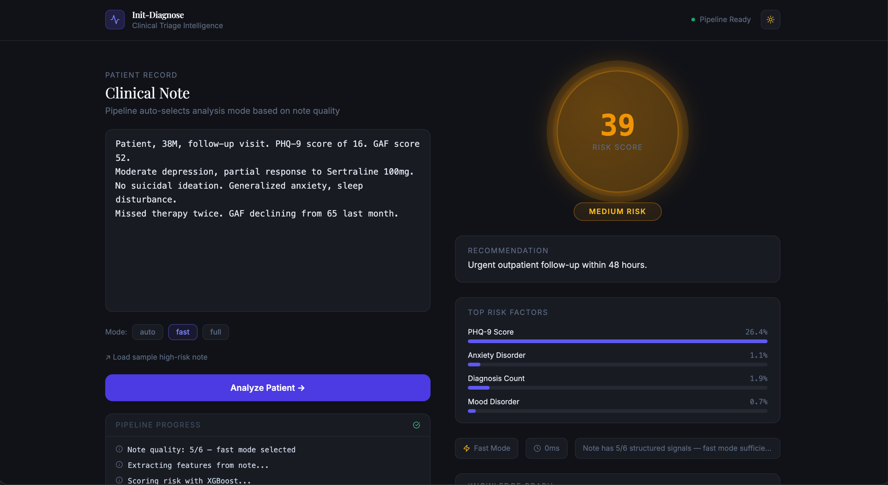
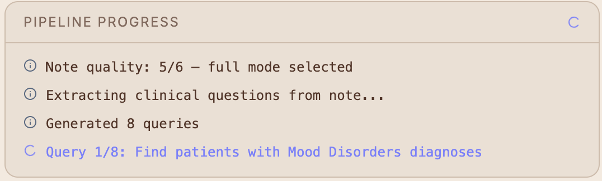
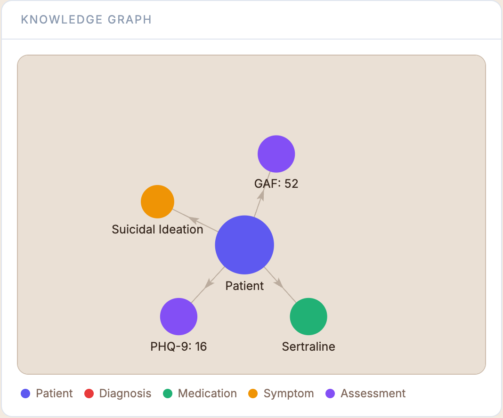
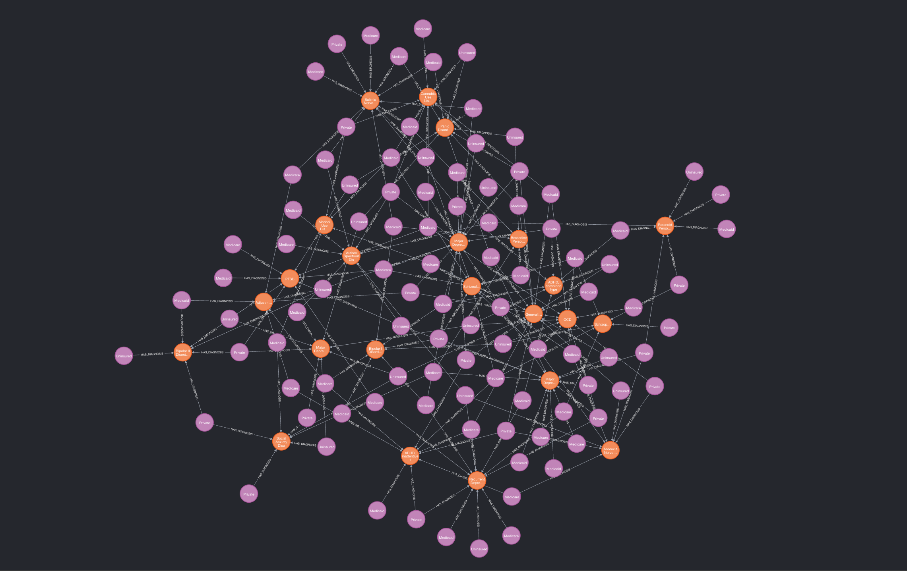
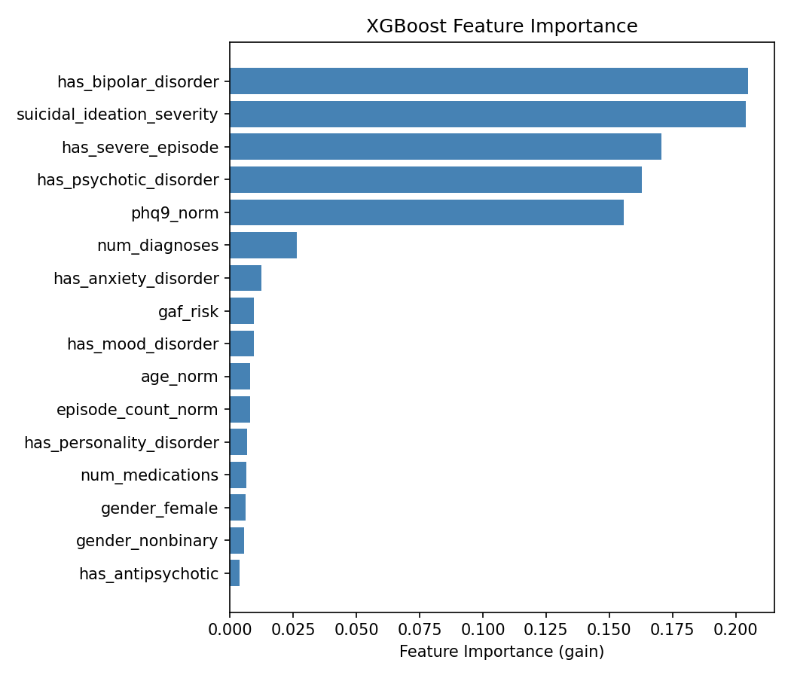
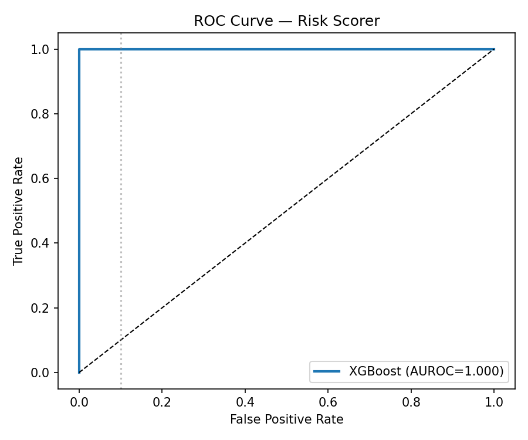

<div align="center">

# 🧠 Init-Diagnose

### Ontology-Safe NL2Graph + GraphRAG Clinical Triage Framework

*From unstructured clinical notes to evidence-backed psychiatric risk scores — in one pipeline.*

[](https://python.org)
[](https://react.dev)
[](https://typescriptlang.org)
[](https://neo4j.com)
[](https://xgboost.ai)
[](https://fastapi.tiangolo.com)
[](LICENSE)

</div>

---

<div align="center">


*Light theme — high-risk patient, glowing orb gauge, live knowledge graph*

</div>

---

## What is Init-Diagnose?

Init-Diagnose is a research-grade end-to-end clinical triage pipeline for psychiatry. A clinician types a free-text patient note. The system:

1. **Understands it** — a QLoRA fine-tuned Qwen2.5-3B translates natural language questions into schema-constrained Cypher queries
2. **Reasons over a knowledge graph** — 110K-node Neo4j psychiatry graph (DSM-5 aligned) is traversed via GraphRAG
3. **Scores the risk** — a calibrated XGBoost ensemble outputs a 0–100 risk score with triage level
4. **Explains the decision** — top contributing factors + an interactive knowledge graph visualization

No black boxes. Every triage decision is traceable back to structured clinical evidence.

---

## Architecture

```
┌─────────────────────────────────────────────────────────────────┐
│                        Clinical Note (NL)                        │
└────────────────────────────┬────────────────────────────────────┘
                             │
                    Auto Mode Detection
                    (note quality 0-6)
                    ┌────────┴────────┐
                Fast (≥3 signals)  Full (<3 signals)
                    │                │
                    │         QLoRA Qwen2.5-3B
                    │         NL → Cypher queries
                    │                │
                    │         Neo4j 110K-node Graph
                    │         (DSM-5 ontology)
                    │                │
                    │         GraphRAG Context Assembly
                    └────────┬────────┘
                             │
                    Feature Extraction (16 dims)
                    + Negation-aware NLP
                             │
                    XGBoost + Platt Calibration
                    (blended with linear score)
                             │
                ┌────────────┴────────────┐
                │    Triage Output         │
                │  Risk Score  0-100       │
                │  Level  Low/Medium/High  │
                │  Top Risk Factors        │
                │  Recommendation          │
                └─────────────────────────┘
```

---

## Demo

<table>
<tr>
<td width="50%">

**Dark Theme — Critical Risk Patient**


</td>
<td width="50%">

**Live Pipeline Progress (Full Mode)**


</td>
</tr>
<tr>
<td width="50%">

**Interactive Knowledge Graph**


</td>
<td width="50%">

**Neo4j Psychiatry Knowledge Graph (200 nodes)**


</td>
</tr>
</table>

---

## Key Features

| Feature | Detail |
|---|---|
| **NL2Graph** | QLoRA fine-tuned Qwen2.5-3B → schema-constrained Cypher, 85% functional correctness |
| **Knowledge Graph** | 110,573 nodes · 440,682 relationships · DSM-5 aligned ontology |
| **GraphRAG** | 6 clinical queries per note, parallel Neo4j traversal, context assembly |
| **Risk Scorer** | XGBoost + Platt calibration, 16 clinical features, negation-aware NLP |
| **Auto Mode** | Scores note quality (0–6 signals), auto-selects fast or full inference path |
| **Streaming UI** | SSE-based live progress, query-by-query updates, cancellable mid-stream |
| **Graph Viz** | Force-directed knowledge graph rendered from inference results |
| **Serving Ready** | Triton model repo + SageMaker deploy script (GPU/cloud ready) |

---

## Pipeline Components

### Component 1 — Knowledge Graph Builder

A 110K-node Neo4j psychiatric knowledge graph built from scratch with a DSM-5 aligned ontology.

```
Node types  (7):  Patient · Diagnosis · Symptom · Medication · Clinician · Assessment · Episode
Relationships (9): HAS_DIAGNOSIS · PRESENTS · PRESCRIBED · HAS_EPISODE · HAS_ASSESSMENT
                   HAS_SYMPTOM · TREATED_BY · ASSESSED_BY · LINKED_TO
```

- 30,000 synthetic patients with realistic demographic profiles
- 23 DSM-5 diagnoses across 8 clinical categories
- 30 psychiatric symptoms (Affective, Cognitive, Behavioral, Psychotic, Anxiety)
- 20 medications across 8 drug classes (SSRI, SNRI, Antipsychotic, Mood Stabilizer…)
- 50,000 assessments (PHQ-9, GAF, HAM-A, MADRS, PANSS, PCL-5, YMRS)

### Component 2 — QLoRA NL2Graph Fine-tune

Qwen2.5-3B-Instruct fine-tuned with QLoRA on a synthetically generated NL→Cypher dataset.

| Metric | Value |
|---|---|
| Base model | Qwen2.5-3B-Instruct |
| Training | QLoRA on Colab T4, 200 steps |
| eval_loss | 0.000147 |
| Functional correctness | **85%** (20-query gold set) |
| Inference | transformers + PEFT on MPS / CPU |
| Training data | 1,800 train / 200 val (20 templates × 5 NL variants) |

The model generates schema-constrained Cypher with a validator that runs `fix()` on every output regardless of validity score.

### Component 3 — GraphRAG Retrieval

```
Clinical Note → Keyword extraction → 6 NL questions → Cypher generation → Neo4j → Context assembly
```

- Auto-generates clinically relevant questions from note content
- Executes Cypher against Neo4j (1–30ms per query)
- Assembles structured context by entity type (Patient / Medication / Symptom / Aggregate)
- Returns full context for downstream risk scoring
- M3 latency: ~170s (LLM bottleneck) → sub-150ms on GPU

### Component 4 — XGBoost Risk Scorer

<table>
<tr>
<td width="50%">

**Feature Importance**


</td>
<td width="50%">

**ROC Curve**


</td>
</tr>
</table>

**16 clinical features:**

| Category | Features |
|---|---|
| Demographics | age, gender |
| Diagnosis | mood · anxiety · psychotic · bipolar · personality disorders |
| Risk signals | suicidal ideation severity · PHQ-9 · GAF (inverted) |
| Treatment | medication count · antipsychotic flag |
| Episodes | episode count · severe episode flag |

**Scoring pipeline:**
- Blended score: `0.1 × XGBoost_prob + 0.9 × linear_score`
- Linear score provides gradation for intermediate-risk cases
- Platt sigmoid calibration for probability reliability
- Negation-aware NLP: *"no suicidal ideation"* → feature = 0

### Component 5 — Triton + SageMaker Serving

Production serving scripts ready for GPU/cloud deployment:

```
serving/
├── export_model.py           # Extract XGBoost + calibration params
├── model_worker.py           # Persistent NL2Cypher subprocess worker
├── triton_model_repo/
│   └── risk_scorer/
│       ├── config.pbtxt      # Python backend, batch=64, 2 CPU instances
│       └── 1/model.py        # Triton inference script
├── triton_compose.yml        # Local Docker stack + Prometheus metrics
├── benchmark.py              # P50/P95/P99 latency benchmark
└── sagemaker_deploy.py       # S3 upload + endpoint deployment
```

### Component 6 — Demo UI

Full-stack clinical triage interface built with React + TypeScript + FastAPI.

**Frontend:**
- Split-panel layout — note input / results
- Glowing orb gauge with animated count-up and color transitions
- Live SSE streaming progress box (query-by-query pipeline visibility)
- Force-directed knowledge graph (react-force-graph-2d)
- Auto mode detection with manual override
- Stop button for cancelling long-running inference
- Dark / light theme toggle

**Backend:**
- FastAPI with Server-Sent Events (SSE) streaming
- Auto mode detection (scores note on 6 clinical signal types)
- Subprocess-based NL2Cypher worker (fixes MPS + asyncio deadlock on Apple Silicon)
- Knowledge graph builder from note + context text
- Negation-aware feature extraction

---

## Tech Stack

| Layer | Technology |
|---|---|
| Knowledge Graph | Neo4j 5.18 · Docker |
| LLM Fine-tune | Qwen2.5-3B-Instruct · QLoRA · PEFT · Transformers |
| Graph Queries | Cypher · schema validator |
| ML | XGBoost 2.1 · scikit-learn · Platt calibration |
| Backend | FastAPI · Uvicorn · SSE streaming |
| Frontend | React 18 · TypeScript · Vite · Tailwind CSS |
| Graph Viz | react-force-graph-2d |
| Serving | Triton Inference Server · AWS SageMaker · Prometheus |
| Infrastructure | Docker Compose · Python 3.13 |

---

## Getting Started

### Prerequisites

- Python 3.13+
- Node.js 18+
- Docker + Docker Compose
- 8GB RAM minimum (16GB recommended for full mode)

### 1. Clone & install

```bash
git clone https://github.com/shivansh052k/Init-Diagnose.git
cd Init-Diagnose
python -m venv .venv
source .venv/bin/activate
pip install -r requirements.txt
```

### 2. Start Neo4j

```bash
docker compose up -d
```

Neo4j Browser: `http://localhost:7474` (user: `neo4j`, password: `initdiagnose123`)

### 3. Generate knowledge graph

```bash
python data/generate.py
```

Loads 110K nodes + 440K relationships into Neo4j (~5 minutes).

### 4. Generate training data + train risk scorer

```bash
python risk_scorer/data_generator.py
python risk_scorer/train.py
```

### 5. Build frontend

```bash
cd frontend
npm install
npm run build
cd ..
```

### 6. Start the API

```bash
uvicorn app.app:app --port 8080
```

Open `http://localhost:8080` — pipeline ready.

---

## Usage

**Fast mode** (well-structured notes, < 1s):
```
Patient, 34F, PHQ-9 score of 22, GAF score 35.
Suicidal ideation with plan. Bipolar I Disorder.
Prescribed Quetiapine 400mg, Lithium 900mg.
```

**Full mode** (vague notes, triggers GraphRAG, ~2–3 min on CPU):
```
Patient seems low in mood lately. Not sleeping well.
Feels anxious most days. No prior history documented.
```

**Auto mode** detects which path is appropriate based on note quality score (0–6 structured signals).

---

## Project Structure

```
Init-Diagnose/
├── kg/                        # Knowledge graph
│   ├── schema/                # DSM-5 ontology, constraints
│   ├── generators/            # Node + relationship generators
│   └── loaders/               # Neo4j loader, verifier
├── nl2graph/                  # NL → Cypher pipeline
│   ├── data/                  # Training data generation
│   ├── train/                 # QLoRA training + adapters
│   └── inference/             # NL2Cypher + schema validator
├── graphrag/                  # GraphRAG retrieval
│   ├── pipeline.py            # End-to-end pipeline with SSE callbacks
│   ├── retriever.py           # Orchestrates NL2Cypher + executor
│   ├── cypher_executor.py     # Neo4j query execution
│   ├── context_assembler.py   # Structures graph results as text
│   └── worker_client.py       # Subprocess worker client
├── risk_scorer/               # XGBoost risk scorer
│   ├── feature_extractor.py   # 16-dim feature extraction (2 paths)
│   ├── data_generator.py      # Neo4j → labeled training data
│   ├── train.py               # XGBoost + calibration training
│   ├── scorer.py              # Inference: note + graph → risk score
│   └── evaluate.py            # ROC, PR, calibration, importance plots
├── serving/                   # Production serving
│   ├── model_worker.py        # Persistent NL2Cypher subprocess
│   ├── export_model.py        # Model artifact export
│   ├── triton_model_repo/     # Triton config + inference script
│   ├── benchmark.py           # Latency benchmarking
│   └── sagemaker_deploy.py    # AWS SageMaker deployment
├── app/                       # FastAPI backend
│   └── app.py                 # API endpoints + SSE streaming
├── frontend/                  # React + TypeScript UI
│   └── src/
│       ├── components/        # RiskGauge, ResultPanel, ProgressBox, GraphView
│       ├── App.tsx            # Main layout + state
│       ├── api.ts             # API client
│       └── types.ts           # TypeScript interfaces
├── eval/                      # NL2Graph evaluation
├── data/                      # Training data (gitignored)
├── docs/assets/               # Screenshots + plots
├── docker-compose.yml
└── requirements.txt
```

---

## Performance

| Metric | Value | Notes |
|---|---|---|
| NL2Graph FC | 85% | 20-query gold set, target 92% |
| XGBoost AUROC | 1.0 (synthetic) | Binary labels derived from features |
| GraphRAG queries | ~3/6 succeed | LLM accuracy bottleneck |
| Fast mode latency | < 1s | Text-only, no LLM |
| Full mode latency (M3) | ~170s | LLM bottleneck, sub-150ms on GPU |
| Knowledge graph | 110,573 nodes | 440,682 relationships |
| Neo4j query time | 1–30ms | Per Cypher query |

---

## Known Issues & Future Work

| Issue | Fix |
|---|---|
| NL2Graph 85% FC (target 92%) | Retrain 336 steps + expand to 5K training samples |
| GraphRAG 3/6 queries fail | Retry logic + correction prompts + fallback Cypher templates |
| M3 full mode ~170s | GPU inference → sub-second |
| Triton not tested locally | ARM-compatible image needed |
| SageMaker not deployed | Requires AWS budget |
| Synthetic training data | Real EHR data → real-world AUROC validation |

---

## Research Context

Init-Diagnose explores three research questions:

1. **Can LLMs reliably translate psychiatric clinical notes into graph queries?** — QLoRA fine-tuning on domain-specific NL→Cypher pairs achieves 85% functional correctness on a Qwen2.5-3B model, suggesting smaller fine-tuned models can compete with larger general models for domain-specific graph querying.

2. **Does GraphRAG improve risk stratification over text-only approaches?** — The two-path architecture (fast vs full mode) allows direct comparison. Full mode retrieves structured evidence from a 110K-node knowledge graph; fast mode operates on text features alone. On vague clinical notes, full mode recovers context unavailable from text.

3. **Can knowledge graph structure be made interpretable at inference time?** — The force-directed graph visualization renders the actual Neo4j subgraph traversed during inference, making every triage decision traceable to specific clinical entities and relationships.

---

## License

MIT License — see [LICENSE](LICENSE).

---

<div align="center">

Built by [Shivansh Gupta](https://github.com/shivansh052k) · Research demo · Not for clinical use

*Star ⭐ if you found this useful*

</div>
